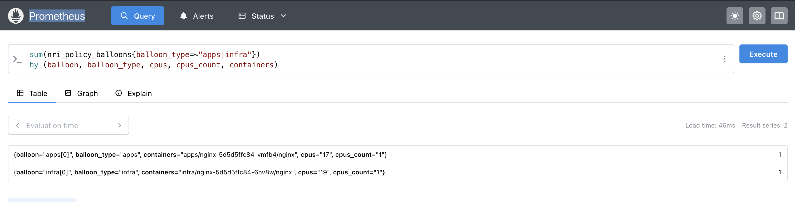
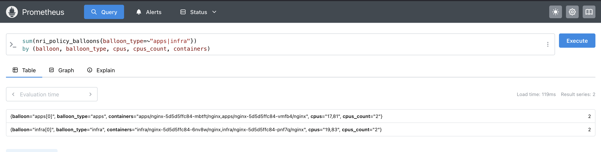

# oss-europe-25

Hi, thanks for attending our talk on [server partitioning without VMs](https://osseu2025.sched.com/event/25Vrb/server-partitioning-without-vms-for-flexibility-and-performance-antti-kervinen-intel-feruzjon-muyassarov-ericsson-software-technology). Below, you’ll find all the required steps to reproduce the scenarios shown during the demo. If you have any questions, feel free to reach out to me or submit a GitHub issue in the [nri-plugins](https://github.com/containers/nri-plugins) repository.

### Prerequisites
- Kubernetes 1.24+
- Container runtime:
    - containerD: At least v1.7.0 release version to use the NRI feature
    - CRI-O: At least v1.26.0 release version to use the NRI feature

## step #1
Deploy the Balloons - Node Resource Interface (NRI) plugin. The Balloons NRI resource policy plugin implements workload placement into “balloons” that are disjoint CPU pools. If you are running a containerd version earlier than `v2.*`, you need to enable the NRI interface in the runtime using a Helm flag. To do this, add `--set nri.runtime.patchConfig=true` at the end of the helm install ... command.

```shell
helm repo add nri-plugins https://containers.github.io/nri-plugins
helm install balloons-oss -n kube-system nri-plugins/nri-resource-policy-balloons  --set config.instrumentation.prometheusExport=true
```

## step #2
Ensure that the balloons policy plugin is running. Then, add the following balloonTypes to the pre-created BalloonsPolicy Custom Resource (CR) object in the kube-system namespace.

```shell
kubectl edit BalloonsPolicy -n kube-system default
# once you are on editor mode, add the below YAML snippet
```

```YAML
- name: infra
    namespaces:
    - infra
    preferCloseToDevices:
    - /sys/devices/system/cpu/cpu15
    preferNewBalloons: false
    preferSpreadingPods: false
    shareIdleCPUsInSame: l2cache
- name: apps
    namespaces:
    - apps
    preferCloseToDevices:
    - /sys/devices/system/cpu/cpu80
    preferNewBalloons: false
    preferSpreadingPods: false
    shareIdleCPUsInSame: l2cache
```

## step #3
Next, apply the manifests to create the apps and infra namespaces, along with their corresponding Deployments:

```shell
kubectl apply -f infra.yaml
kubectl apply -f apps.yaml
```

This will create one Guaranteed Pod in each namespace (apps and infra), with each Pod requesting 1 CPU core. Each of these Pods will land on its own balloon instance based on the configuration above.

| Pod Name | Balloon  |
|----------|----------|
| apps     | l2burst  |
| infra    | l2pack   |

## step #4
In the above BalloonsPolicy configuration, we specified that the l2burst balloon should be placed closer to the `/sys/devices/system/cpu/cpu15` device, and the l2pack balloon closer to the `/sys/devices/system/cpu/cpu80` device. This means the Balloons plugin will attempt to allocate CPU cores for each balloon in proximity to the designated devices. Let's check that by running kube-cgroups script.

```shell
./kube-cgroups  -f cpuset.cpus.effective -n apps
apps/nginx-5d5d5ffc84-vmfb4:
  nginx:
    cpuset.cpus.effective: 17
```

```shell
./kube-cgroups  -f cpuset.cpus.effective -n infra
infra/nginx-5d5d5ffc84-6nv8w:
  nginx:
    cpuset.cpus.effective: 19
```
This shows that currently in apps namespace there is one Pod nginx-5d5d5ffc84-vmfb4 which uses core 17 and nginx-5d5d5ffc84-6nv8w is on core 19. Let's also check the same from the Prometheus metrics:



## step #5
The next step is to inflate the balloon by increasing the Deployment replicas and observe how it behaves — in other words, whether it will pick a free CPU core randomly or adhere to our instruction to stay closer to the same L2 cache as the current CPU core.

Before scaling the Deployment, let's first check which cores are neighbors to cores 17 and 19. These are the cores we should expect the balloon to select according to its policy after the inflation. So, we should expect 81 and 83 to be picked up.

```shell
./cache_lookup_l2.sh 17
L2 cache usage for CPUs: 17
  L2 ID 68 (size 2048K) → shared by CPUs: 17,81
```

```shell
./cache_lookup_l2.sh 19
L2 cache usage for CPUs: 19
  L2 ID 82 (size 2048K) → shared by CPUs: 19,83
```

Let's now scale up our Deployments.
```shell
kubectl scale deploy nginx -n infra --replicas 2
kubectl scale deploy nginx -n apps --replicas 2
```

Let's check again the CPU cores used by our Deployments:

```shell
./kube-cgroups  -f cpuset.cpus.effective -n apps
apps/nginx-5d5d5ffc84-vmfb4:
  nginx:
    cpuset.cpus.effective: 17,81
```

```shell
./kube-cgroups  -f cpuset.cpus.effective -n infra
infra/nginx-5d5d5ffc84-6nv8w:
  nginx:
    cpuset.cpus.effective: 19,83
```

Let's also check the same from the Prometheus metrics:




That's all for today. Thank you!

## Links
- NRI: https://github.com/containerd/nri
- NRI plugins: https://github.com/containers/nri-plugins
- another hub for community plugins: https://github.com/containerd/nri/tree/main/plugins

## Demo


